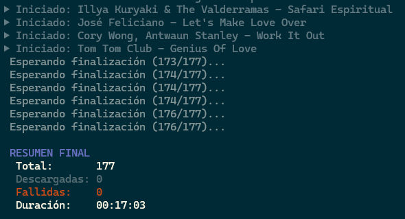

## txtPlaylist downloader

Script de PowerShell para descargar gran cantidad de canciones usando yt-dlp.

### Características

- Descargas automatizadas de audio en formato MP3
- Descargas paralelas configurables.
- Resumen final de resultados
- Manejo de errores y reintentos

### Requisitos

- [yt-dlp](https://github.com/yt-dlp/yt-dlp) instalado y en el PATH

### Uso

1. Crea un archivo `playlist.txt` con las canciones (una por línea):
   ```
   Viagra Boys - Return To Monke
   Queen - Bohemian Rhapsody
   Pink Floyd - Wish You Were Here
   ```
   o generalo automáticamente con [SpotPlaylistToText](https://github.com/999monk/SpotPlaylistToText)

2. Ejecuta el script:
   ```powershell
   .\PlaylistDownloader.ps1
   ```

3. Los archivos MP3 se guardarán por defecto en la carpeta `playlist/`

### Configuración

Puedes modificar estas variables al inicio del script:

- `$MaxParallelDownloads`: Número de descargas simultáneas (por defecto: 4)
- `$playlistPath`: Ruta del archivo de playlist
- `$destDir`: Carpeta de destino

### Ejemplo 




